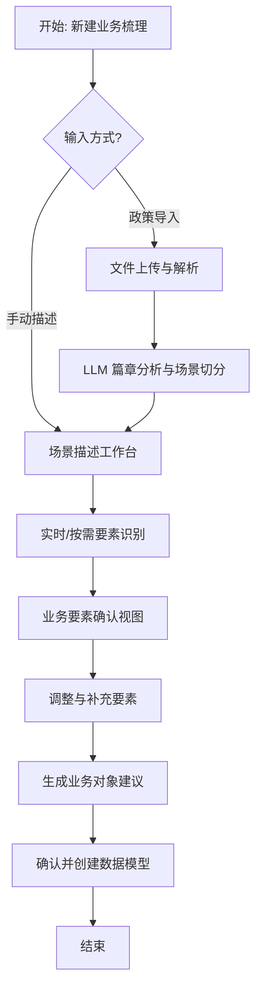

# 场景驱动的业务建模产品设计方案

**文档信息**
- **创建时间**: 2026-01-16 11:00
- **版本**: V1.0
- **状态**: 待评审

---

## 1. 核心设计理念

### 1.1 背景与痛点
传统的业务建模往往要求业务人员通过抽象的"实体-关系"图（ER图）或技术化的表格来定义业务。这种方式存在以下问题：
- **门槛高**: 业务人员难以直接将业务知识转化为抽象模型。
- **由果推因**: 往往是先有了数据库表，反推业务对象，导致模型被物理实现绑架。
- **割裂感**: 业务场景描述（文档）与数据模型（元数据）分离，模型无法追溯业务来源。

### 1.2 解决方案：场景驱动建模 (Scenario-Driven Modeling)
本方案提出"**从自然语言到结构化模型**"的全新路径：
1. **输入**: 真实的业务场景描述（"讲故事"）或原始政策文件。
2. **处理**: 利用 LLM 智能提取业务要素（主体、行为、客体、状态、规则）。
3. **输出**: 自动生成的业务对象初步模型，经人工确认后生效。

---

## 2. 详细业务流程设计

### 2.1 总体工作流


### 2.2 核心功能模块详情

#### ① 政策文件智能导入模块
**功能逻辑**:
1. **文件解析**: 支持 PDF (含扫描件 OCR)、Word、图片。
2. **结构化处理**: 识别文档的章节（Chapter）、条款（Article）。
3. **场景切分 (Semantic Chunking)**:
   - LLM 分析文本语义，将描述同一事项的段落聚合为一个"场景片段"。
   - *策略*: 依据标题级别切分，或者依据关键词（"申请...","办理..."）进行聚类。
4. **置信度评估**: 对提取的场景给出一个 Confidence Score，低置信度的场景标记为"需人工复核"。

**交互设计**:
- 上传区支持拖拽多种格式。
- 解析过程中展示进度条和当前处理的页码。
- 解析完成后，左侧展示原文预览，右侧展示提取出的"场景列表"卡片，用户可勾选采纳。

#### ② 场景描述工作台 (Rich Text Editor + AI)
**功能逻辑**:
- **智能高亮 (NER)**:
  - 自动识别文本中的命名实体，并用不同颜色高亮：
    - <span style="color:#3b82f6">主体 (Subject)</span>: 蓝色
    - <span style="color:#10b981">行为 (Action)</span>: 绿色
    - <span style="color:#f59e0b">客体/资源 (Object)</span>: 橙色
    - <span style="color:#8b5cf6">状态 (State)</span>: 紫色
- **智能补全**: 当用户输入"残疾人提交..."时，AI 联想补全后续可能的标准动作"...申请材料"。

**提示词策略 (Prompt Strategy)**:
> "分析以下业务描述，提取'谁(Subject)对什么(Object)做了什么(Action)导致了什么变化(State)'。同时识别其中的业务约束条件(Rule)。"

#### ③ 业务要素提取与映射引擎
这是连接自然语言与数据模型的桥梁。

| 业务要素 (自然语言) | 映射逻辑 | 数据模型 (业务对象) |
| :--- | :--- | :--- |
| **主体 (Subject)** | 聚类去重 (如: 申请人/市民 -> 公民) | **业务对象 (Business Object)** |
| **客体 (Object)** | 识别名词 | **业务对象** 或 **属性 (Attribute)** |
| **行为 (Action)** | 识别动词 | **业务操作 (Operation/Method)** 或 **事件 (Event)** |
| **状态 (State)** | 识别形容词/状态词 | **状态机 (State Machine) & 状态字段** |
| **规则 (Rule)** | 识别条件句 ("如果...必须...") | **业务规则 (Validation Rule)** |

#### ④ 模型生成与确认
**功能逻辑**:
- **对象合并**: 如果多个场景都提取到了"申请人"，系统应建议关联到已有的"公民"对象，而不是新建。
- **属性推断**: 根据上下文推断属性类型（如：识别到"身份证号" -> 推断为 String(18) 且为唯一键）。
- **可视化预览**: 生成临时的 ER 关系图，展示对象间的关联（由"行为"连接，如：公民 --(提交)--> 申请）。

---

## 3. 页面详细功能规范

### 3.1 页面: 场景列表 (Dashboard)
- **统计区**:
  - 全局进度: 场景数 / 已建模转化率。
- **场景卡片**:
  - 状态标签: [草稿] [识别中] [已提取] [已建模]
  - 快捷操作: 立即分析、查看模型、删除。

### 3.2 页面: 场景编辑器 (Editor)
- **布局**:
  - 左侧: 文本编辑区 (类似 Notion)。
  - 右侧: 分析结果面板 (Analysis Panel)。
- **右侧面板内容**:
  - **要素清单**: 分类展示识别到的要素，支持点击定位到左侧原文。
  - **对象建议**: "基于此场景，建议定义以下 3 个业务对象..."
  - **一键生成按钮**: "创建/更新数据模型"。

### 3.3 页面: 政策导入向导 (Import Wizard)
- **Step 1**: 上传文件。
- **Step 2**: 预览与清洗 (用户可删除不需要的页码或段落)。
- **Step 3**: AI 结构化结果确认 (场景切分确认)。
- **Step 4**: 导入至场景列表。

---

## 4. 技术实现关键点

### 4.1 LLM 服务层
- **模型选择**: 建议使用长文本能力强的模型 (如 Claude 3.5 Sonnet / GPT-4o) 以处理长政策文档。
- **JSON Mode**: 强制 LLM 输出标准 JSON 格式以便前端渲染。
  ```json
  {
    "scenarios": [
      {
        "name": "残疾证申领",
        "description": "...",
        "elements": {
          "subjects": ["残疾人", "县残联"],
          "actions": ["提交", "审核"],
          ...
        }
      }
    ]
  }
  ```

### 4.2 前端交互
- **编辑器框架**: 建议使用 **Tiptap** 或 **Slate.js**，便于实现自定义的高亮节点 (Decorator Nodes) 和悬浮菜单。
- **状态管理**: 需维护 `TextContent` 与 `ExtractedMeta` 的实时同步。

---

## 5. 后续规划 (Roadmap)

- **P1 (MVP)**:
  - 基础的场景文本编辑与保存。
  - 简单的规则式关键词提取。
  - 基础的业务对象创建表单。
- **P2 (AI Enhanced)**:
  - 接入 LLM 实现政策文件解析。
  - 实现基于语义的要素自动高亮。
  - 自动生成对象属性建议。
- **P3 (Advanced)**:
  - 场景与模型的双向溯源 (修改模型反向提示更新场景描述)。
  - 复杂的状态机自动生成。

---
