---

### 一、 “综合语义结论”页 (Decision Page) —— 增强“判决力”

**核心目标：** 从“展示信息”升级为“提供决策证据链”。让用户在点击“确认”前，不仅看到结果，还能一眼看到**支撑结果的铁证**。

#### 1. 布局重构：打破折叠，证据外露

* **现状问题：** “生命周期”和“质量安全”被折叠在 Tab 里，导致判断对象类型的依据（如：是否有删除时间、是否高密级）被隐藏。
* **改进规范：**
* **移除折叠 Tab：** 改为 **“证据仪表盘 (Evidence Dashboard)”** 布局。
* **三栏式平铺：**
* **左栏（生命周期）：** 显性展示 `更新周期` (T+1)、`数据保留` (永久)。*（逻辑：有生命周期通常意味着是“主体”或“行为”）。*
* **中栏（质量画像）：** 显性展示 `核心字段填充率` (98%)、`主键唯一性` (通过)。*（逻辑：质量太差的表不配做核心实体）。*
* **右栏（安全合规）：** 显性展示 `最高密级` (L3)、`敏感字段数` (2个)。


* **视觉降噪：** 使用轻量化的 Key-Value 对齐排版，不要用重边框。


#### 2. 新增关键属性：数据分层 (Data Layer)

* **设计依据：** 同样的“订单”概念，在 ODS 层（原始快照）和 DWD 层（明细事实）的语义完全不同。
* **交互规范：**
* **位置：** 放在“归属业务域”右侧。
* **组件：** 下拉选择器 + 自动推断。
* **逻辑：** * 表名含 `ods_` -> 自动填 `ODS (贴源层)`。
* 表名含 `dwd_` -> 自动填 `DWD (明细层)`。
* 表名含 `dim_` -> 自动填 `DIM (公共维度)`。


#### 3. 增强“置信度”的情感化设计

* **现状问题：** 0.86 的绿色背景太平淡。
* **改进规范：**
* **分段视觉：**
* `> 0.9` (极高信)：使用 **金色/深绿色徽章** + ✨ 图标。文案：“AI 确信”。
* `0.6 - 0.9` (可信)：使用 **蓝色徽章**。文案：“AI 推荐”。
* `< 0.6` (存疑)：使用 **橙色/灰色徽章**。文案：“需人工复核”。


**—— 核心变化：将折叠的 Tab 展开为“三栏式证据仪表盘”，增加数据分层选择。**

#### 1. 视觉布局描述 (Visual Spec)

* **整体风格：** 现代 SaaS 风格，白底，微投影，主色调为字节紫/阿里云蓝。
* **头部 (Header)：**
* 标题：**“综合语义结论”**
* 右侧徽章：**✨ AI 确信 (0.92)** —— *背景色为浅金色，文字深金，配闪光 Icon，不再是平淡的绿色。*


* **第一行：基础定义**
* 业务名称输入框：“订单主表”
* 归属业务域：“交易域”
* **[新增] 数据分层：** 下拉框显示 **“DWD (明细层)”**。


* **第二行：对象分类 (Tag Selector)**
* 五个胶囊按钮横排：**[主体(选中-紫色实心)]** [行为] [状态] [规则] [属性]。
* 下方跟随小字：*“AI 判断：表名包含 'order_main' 且具备唯一主键及生命周期。”*


* **第三行：证据仪表盘 (Evidence Dashboard) —— *这是最大的视觉改动***
* 不再是折叠的 Tab，而是三个平铺的浅灰色圆角卡片：
* **卡片1（生命周期）：** 图标🕒，主文字 **“永久保留”**，副文字“更新周期 T+1”。
* **卡片2（质量画像）：** 图标🩺，主文字 **“98% 填充率”**，副文字“主键唯一性通过”。
* **卡片3（安全合规）：** 图标🛡️，主文字 **“L3 敏感”** (红色高亮)，副文字“包含 PII 字段”。


* **底部：**
* 右下角按钮：**“确认并生成逻辑实体”** (深紫色渐变，高投影，强调点击欲)。


---

### 二、 “语义理解引擎”详情页 (Diagnosis Page) —— 强化“解释性”

**核心目标：** 将“评分”变成“诊断报告”。让用户知道为什么是 A 级，为什么是 L2 级。

#### 1. 安全维度的视觉警示 (Security Alert)

* **设计依据：** 安全等级是红线，L1 和 L2 必须有本质区别。
* **交互规范：**
* **图标化：** 所有 L2 及以上等级，必须在等级文字前加 **🔒 (锁图标)**。
* **色彩分级：**
* L1 (公开): 灰色/淡蓝背景。
* L2 (内部): <span style="background:#fff7e6; color:#fa8c16; border:1px solid #ffd591; padding: 2px 5px; border-radius: 4px;">🔒 L2 内部</span> (橙色系)。
* L3/L4 (敏感/机密): <span style="background:#fff1f0; color:#f5222d; border:1px solid #ffa39e; padding: 2px 5px; border-radius: 4px;">🔒 L3 敏感</span> (红色系+闪烁红点)。


#### 2. 质量评分的“透视”交互 (Explainable Quality)

* **设计依据：** 用户看到“A”是不够的，需要知道是否有隐患。
* **交互规范：**
* **Hover 交互：** 鼠标悬停在评分 `A/B/C` 上时，弹出 **“质量微报 (Quality Tip)”** 浮层。
* **浮层内容：**
* `空值率`: 2% (正常)
* `唯一性`: 100% (完美)
* `正则匹配度`: 99.8% (正常)


#### 3. 语义角色的“超链接化” (Linked Context)

* **设计依据：** 孤立的“标识符”没有意义，必须指向它代表的对象。
* **交互规范：**
* **组件升级：** 将“标识符”文本改为 **Link Button** 样式。
* **显示逻辑：** `标识符` -> `标识符 (指向: 订单)`。
* **点击动作：** 点击跳转到“订单”这个逻辑实体的知识图谱页。


#### 4. 新增“问题聚焦”模式

* **设计依据：** 当字段有 50 个时，用户只关心有问题的字段。
* **交互规范：**
* 在列表顶部增加 **Filter Toggle (开关)**：`🔘 只看异常项`。
* **开启后：** 隐藏所有“语义明确、质量A、安全L1”的“三好学生”，只展示“敏感字段”或“质量差”的字段，方便快速治理。


**—— 核心变化：安全锁图标、质量浮层、链接式标识符。**

#### 1. 视觉布局描述 (Visual Spec)

* **顶部卡片：**
* 左卡片：**表维度得分 0.76**。
* 右卡片：**字段维度得分 0.88**。包含“核心字段占比 3/12”的进度条。


* **工具栏：**
* 左侧：搜索框。
* 右侧：**[开关] 只看异常项** (Toggle Switch)。


* **列表区域 (List View) —— *细节炸裂处***
* **行 1 (user_id):**
* 字段名：`user_id` (varchar 32)
* 语义角色：**🔗 标识符 (指向: 用户)** —— *蓝色链接样式，带下划线。*
* 安全等级：**🔒 L2 内部** —— *橙色背景胶囊，左侧带一个小锁图标。*
* 质量信号：**🅰️** (绿色方块)。


* **行 2 (mobile_no):**
* 字段名：`mobile_no`
* 语义角色：`业务属性`
* 安全等级：**🔒 L3 敏感** —— *红色背景胶囊，带锁图标，并有红色呼吸光圈。*
* AI 建议：*“建议添加正则校验”*


* **行 3 (create_time):**
* 字段名：`create_time`
* 语义角色：`生命周期 (创建)`
* 安全等级：L1 公开 (灰色)。


* **交互态 (Hover)：**
* 假设鼠标悬停在第一行的“🅰️”上，出现黑色半透明 Tooltip：
* *“空值率: 0% | 唯一性: 100% | 正则匹配: Pass”*

---

### 三、 流程串联逻辑 (The Workflow)

为了让这两个页面形成闭环，我们需要定义它们之间的数据流转：

```mermaid
graph LR
    A[用户点击'开始理解'] --> B{后端 Agent 运行}
    B -->|Step 1: 扫描| C[生成图2: 诊断报告]
    C -->|用户动作: 修正/确认| D[用户点击'生成结论']
    D -->|Step 2: 聚合| E[生成图1: 综合结论]
    E -->|用户动作: 保存| F[写入元数据中心]

```



### 四、 补充：给后端的 API 数据结构建议

为了支撑上述 UI 变化，后端返回的 JSON 结构建议补充以下字段：

```json
{
  "field_analysis": {
    "field_name": "user_id",
    "security": {
      "level": "L2",
      "is_encrypted": false,
      "alert_icon": "lock", // 控制前端是否显示锁
      "reason": "命中规则：用户ID字段"
    },
    "quality": {
      "grade": "A",
      "metrics": {  // 用于 Hover 浮层展示
        "null_rate": 0.02,
        "unique_rate": 1.0
      }
    },
    "semantics": {
      "role": "identifier",
      "ref_subject": "subject_user", // 关联的主体ID
      "ref_subject_name": "用户"     // 用于前端展示“指向：用户”
    }
  }
}

```


