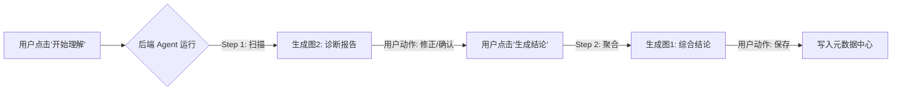

好的，为了保持我们一贯的**“工程化、逻辑化、可落地”**的风格，我将之前的零散建议整理成一份**《语义治理平台 V2.0 界面交互与功能增强规范》**。

这份规范旨在指导前端 UI/UX 设计师和后端开发人员，如何将“三维画像”理念精准地落实到像素和代码中。

---

### 一、 “综合语义结论”页 (Decision Page) —— 增强“判决力”

**核心目标：** 从“展示信息”升级为“提供决策证据链”。让用户在点击“确认”前，不仅看到结果，还能一眼看到**支撑结果的铁证**。

#### 1. 布局重构：打破折叠，证据外露

* **现状问题：** “生命周期”和“质量安全”被折叠在 Tab 里，导致判断对象类型的依据（如：是否有删除时间、是否高密级）被隐藏。
* **改进规范：**
* **移除折叠 Tab：** 改为 **“证据仪表盘 (Evidence Dashboard)”** 布局。
* **三栏式平铺：**
* **左栏（生命周期）：** 显性展示 `更新周期` (T+1)、`数据保留` (永久)。*（逻辑：有生命周期通常意味着是“主体”或“行为”）。*
* **中栏（质量画像）：** 显性展示 `核心字段填充率` (98%)、`主键唯一性` (通过)。*（逻辑：质量太差的表不配做核心实体）。*
* **右栏（安全合规）：** 显性展示 `最高密级` (L3)、`敏感字段数` (2个)。


* **视觉降噪：** 使用轻量化的 Key-Value 对齐排版，不要用重边框。


#### 2. 新增关键属性：数据分层 (Data Layer)

* **设计依据：** 同样的“订单”概念，在 ODS 层（原始快照）和 DWD 层（明细事实）的语义完全不同。
* **交互规范：**
* **位置：** 放在“归属业务域”右侧。
* **组件：** 下拉选择器 + 自动推断。
* **逻辑：** * 表名含 `ods_` -> 自动填 `ODS (贴源层)`。
* 表名含 `dwd_` -> 自动填 `DWD (明细层)`。
* 表名含 `dim_` -> 自动填 `DIM (公共维度)`。


#### 3. 增强“置信度”的情感化设计

* **现状问题：** 0.86 的绿色背景太平淡。
* **改进规范：**
* **分段视觉：**
* `> 0.9` (极高信)：使用 **金色/深绿色徽章** + ✨ 图标。文案：“AI 确信”。
* `0.6 - 0.9` (可信)：使用 **蓝色徽章**。文案：“AI 推荐”。
* `< 0.6` (存疑)：使用 **橙色/灰色徽章**。文案：“需人工复核”。


---

### 二、 “语义理解引擎”详情页 (Diagnosis Page) —— 强化“解释性”

**核心目标：** 将“评分”变成“诊断报告”。让用户知道为什么是 A 级，为什么是 L2 级。

#### 1. 安全维度的视觉警示 (Security Alert)

* **设计依据：** 安全等级是红线，L1 和 L2 必须有本质区别。
* **交互规范：**
* **图标化：** 所有 L2 及以上等级，必须在等级文字前加 **🔒 (锁图标)**。
* **色彩分级：**
* L1 (公开): 灰色/淡蓝背景。
* L2 (内部): <span style="background:#fff7e6; color:#fa8c16; border:1px solid #ffd591; padding: 2px 5px; border-radius: 4px;">🔒 L2 内部</span> (橙色系)。
* L3/L4 (敏感/机密): <span style="background:#fff1f0; color:#f5222d; border:1px solid #ffa39e; padding: 2px 5px; border-radius: 4px;">🔒 L3 敏感</span> (红色系+闪烁红点)。


#### 2. 质量评分的“透视”交互 (Explainable Quality)

* **设计依据：** 用户看到“A”是不够的，需要知道是否有隐患。
* **交互规范：**
* **Hover 交互：** 鼠标悬停在评分 `A/B/C` 上时，弹出 **“质量微报 (Quality Tip)”** 浮层。
* **浮层内容：**
* `空值率`: 2% (正常)
* `唯一性`: 100% (完美)
* `正则匹配度`: 99.8% (正常)


#### 3. 语义角色的“超链接化” (Linked Context)

* **设计依据：** 孤立的“标识符”没有意义，必须指向它代表的对象。
* **交互规范：**
* **组件升级：** 将“标识符”文本改为 **Link Button** 样式。
* **显示逻辑：** `标识符` -> `标识符 (指向: 订单)`。
* **点击动作：** 点击跳转到“订单”这个逻辑实体的知识图谱页。


#### 4. 新增“问题聚焦”模式

* **设计依据：** 当字段有 50 个时，用户只关心有问题的字段。
* **交互规范：**
* 在列表顶部增加 **Filter Toggle (开关)**：`🔘 只看异常项`。
* **开启后：** 隐藏所有“语义明确、质量A、安全L1”的“三好学生”，只展示“敏感字段”或“质量差”的字段，方便快速治理。


---

### 三、 流程串联逻辑 (The Workflow)

为了让这两个页面形成闭环，我们需要定义它们之间的数据流转：



### 四、 补充：给后端的 API 数据结构建议

为了支撑上述 UI 变化，后端返回的 JSON 结构建议补充以下字段：

```json
{
  "field_analysis": {
    "field_name": "user_id",
    "security": {
      "level": "L2",
      "is_encrypted": false,
      "alert_icon": "lock", // 控制前端是否显示锁
      "reason": "命中规则：用户ID字段"
    },
    "quality": {
      "grade": "A",
      "metrics": {  // 用于 Hover 浮层展示
        "null_rate": 0.02,
        "unique_rate": 1.0
      }
    },
    "semantics": {
      "role": "identifier",
      "ref_subject": "subject_user", // 关联的主体ID
      "ref_subject_name": "用户"     // 用于前端展示“指向：用户”
    }
  }
}

```

### 总结

这套补充建议的核心逻辑是：**“显性化”**。
把后台 AI 思考的逻辑、质量探查的细节、安全合规的红线，全部通过 UI 显性地告诉用户，从而建立用户对 AI 语义治理的**信任感**。