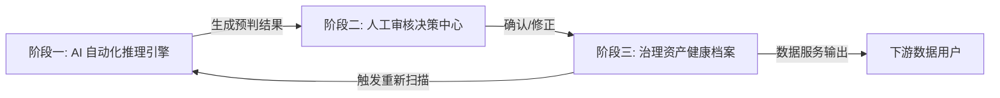

这是一份为您整理的完整的**《企业级 AI 语义治理平台 (V2.0) 产品需求与流程规范文档》**。

这份文档基于我们之前的深度讨论、理论模型确立，以及最终定稿的三张高保真设计图（图5、6、7）汇总而成。它旨在指导开发、算法和设计团队统一目标，实现最终落地。

---

# 企业级 AI 语义治理平台 (V2.0) 需求与流程规范

## 1. 产品愿景与核心目标

**愿景：** 构建一个“懂业务”的数据治理平台，利用 AI 大模型能力，将冰冷的技术元数据自动化地转化为包含**语义、质量、安全**三维信息的企业数据资产，解决“找不到、看不懂、不敢用”的痛点。

**核心目标 (V2.0)：**

1. **自动化率提升：** 实现 80% 以上的核心表语义自动推断与标签打标。
2. **三维一体治理：** 在一个界面内同时呈现数据的业务含义、健康状况和合规要求。
3. **人机协作闭环：** 建立“AI 预判 -> 人工复核 -> 持续学习”的高效治理工作流。

---

## 2. 核心理论模型 (The Kernel)

本平台的设计构建在以下两个核心理论模型之上，所有功能均围绕此展开。

### 2.1. 五大业务对象体系 (用于定性)

用于回答“这张表在业务世界里是什么角色”。

| 对象类型 | 定义 | 典型特征示例 |
| --- | --- | --- |
| **主体 (Entity)** | 业务的核心资源/人/物 | 有唯一 ID，有生命周期 (如：用户、商品) |
| **行为 (Event)** | 发生的业务动作或事件 | 有时间戳，不可变，关联多个主体 (如：订单、日志) |
| **状态 (State)** | 描述主体或行为所处的阶段 | 枚举值，用于流转 (如：订单状态、会员等级) |
| **规则 (Rule)** | 用于计算或判断的逻辑 | 通常体现为计算公式或判定条件 (如：风控规则) |
| **属性 (Attribute)** | 描述对象的静态特征 | 依附于主体或行为存在 (如：手机号、地址) |

### 2.2. 三维数据画像 (用于定量)

用于回答“这个字段具体什么意思，能不能用”。

1. **语义维 (Semantics)：** 它的业务含义、角色（如：标识符）、关联对象。
2. **安全维 (Security)：** 它的敏感等级（L1-L4）、是否包含 PII、脱敏策略。
3. **质量维 (Quality)：** 它的健康状况（空值率、唯一性、规范性评分 A/B/C）。

---

## 3. 核心业务流程 (The Workflow)

基于最终 UI 设计图，平台的核心工作流分为三个阶段：

* **对应界面：**
* 阶段一结果呈现 -> **图 5 (综合语义结论页)**
* 阶段二交互界面 -> **图 6 (语义理解结果审核页)**
* 阶段三最终形态 -> **图 7 (语义理解引擎详情页)**

---

## 4. 详细功能需求说明 (按页面模块)

### 模块一：AI 综合语义结论引擎 (对应 图 5)

**目标：** 清晰展示 AI 的预判结果、置信度以及判断依据，为人工复核提供完整证据链。

**关键需求点：**

1. **置信度与预警机制：**
* 必须显著展示 AI 置信度评分。
* **低分预警：** 当置信度过低（如 0.00）或存在严重质量/安全冲突时，必须显示醒目的橙色/红色警告（如“⚠️ 需复核”）。

2. **业务身份自动填充：**
* AI 需尝试自动推断并预填“业务名称”、“归属业务域”、“数据分层”（如 DWD）。
* 若置信度为 0，占位符应提示“识别失败，请手动输入”。

3. **对象类型分类器：**
* 提供五大对象（主体/行为/状态/规则/属性）的互斥选择组件。
* **AI 判据透出：** 在选择器下方，必须用文字简述 AI 的判断理由（例如：“AI判断: 表名包含实体关键词，且存在有效主键”）。

4. **三栏式证据仪表盘 (核心交互)：**
* **坚决摒弃折叠 Tab，采用平铺展示。**
* **栏目一 (生命周期)：** 展示数据保留策略、更新频率。
* **栏目二 (质量画像)：** 展示核心字段填充率，关键质量问题预警（如“⚠️ 主键缺失”）。
* **栏目三 (安全合规)：** 展示最高安全等级，是否包含 PII。

5. **操作入口：**
* 底部提供“确认并生成逻辑实体”按钮，点击后进入下一阶段或直接归档。

### 模块二：语义理解结果审核中心 (对应 图 6)

**目标：** 为数据管理员提供高效的批量审核界面，快速处理 AI 的不确定项。

**关键需求点：**

1. **任务统计概览：**
* 清晰展示总任务数、已通过数、待审核数。

2. **低置信度根因分析：**
* 结构化展示导致 AI 判断失败的核心原因（如：缺少注释、发现未知字段类型、质量极差等），指导用户进行源头治理。

3. **审核列表摘要视图：**
* 每个待审核表需提供摘要信息：识别字段数、敏感字段数、发现关系数。
* 提供快捷的“接受”和“拒绝”按钮。

4. **审核详情展开（建议增强）：**
* 在展开的字段列表中，建议同步展示图 7 中的**安全等级 (L2/L3)** 和 **质量评分 (A/B/C)**，辅助管理员做决策。

5. **关系可视化（建议增强）：**
* 对于发现的表关系（如 Many-to-One），支持点击弹出简易 ER 图查看。

### 模块三：治理资产健康档案详情 (对应 图 7)

**目标：** 数据资产的最终“户口本”和“体检报告”，是用户查询和使用的终点。

**关键需求点：**

1. **评分卡与问题钻取：**
* 分别展示“表维度”和“字段维度”的健康得分。
* **异常项透出：** 当得分非满分时，必须醒目列出未通过的检测项（如：黄色警告条显示“❌ 是否存在主键字段”），点击可快速过滤下方列表。

2. **三维字段列表 (核心中的核心)：**
* 列表必须完美融合语义、安全、质量信息。
* **语义角色 (Semantics)：**
* 明确标识字段角色（如：标识符、业务属性）。
* **[交互重点] 链接化：** 对于“标识符”角色，必须设计为蓝色链接样式（如 `🔗 标识符`），点击可跳转至其指向的逻辑主体页面。

* **安全等级 (Security)：**
* **[视觉重点] 加锁：** L2 及以上等级，必须使用带 **🔒 小锁图标** 的彩色胶囊（L2橙色，L3/L4红色）进行强警示。

* **质量评分 (Quality)：**
* 使用 A/B/C 等级方块展示。
* **[交互重点] Hover 透视：** 鼠标悬停在评分方块上时，必须弹出浮层展示具体的质量指标（如：空值率: 39%, 唯一性: 100%），解释评分依据。

3. **闭环操作：**
* 提供“重新理解”按钮，允许用户在数据源变更后手动触发新一轮 AI 扫描。

---

## 5. 总结

本规范文档不仅定义了功能，更强调了数据治理的**“证据链”**和用户体验的**“显性化”**。

* **对后端/算法的要求：** API 必须能够结构化地返回判断依据、质量明细指标、安全分级理由。
* **对前端的要求：** 严格还原设计图中的视觉分级（如安全锁的颜色）、实现关键的交互细节（如标识符跳转、质量分 Hover 浮层）。

执行此规范，我们将交付一个逻辑严密、体验领先的企业级语义治理平台。