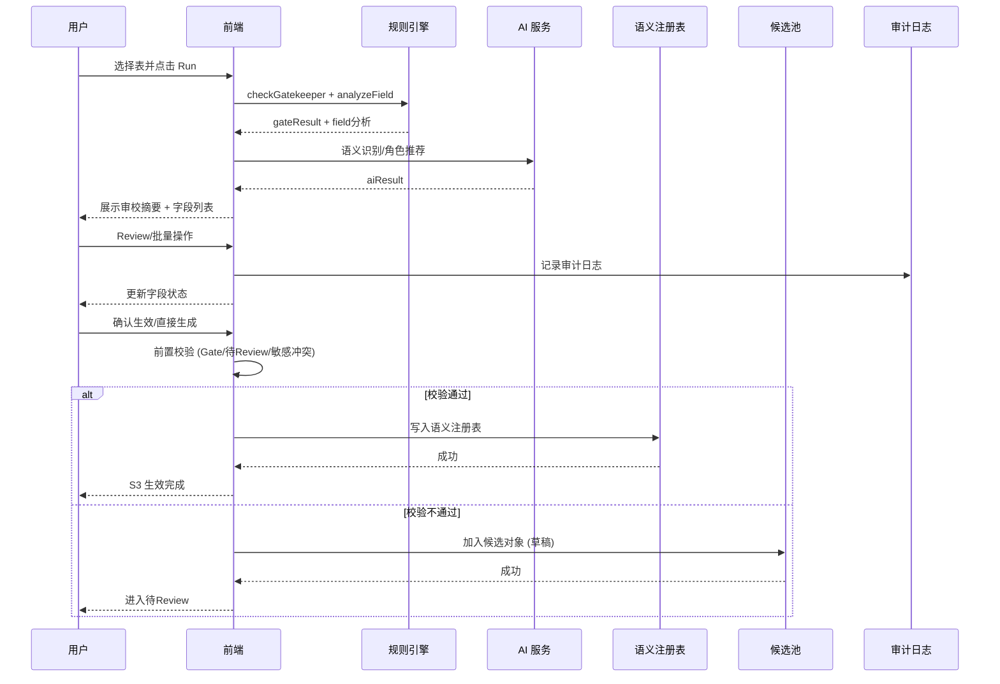
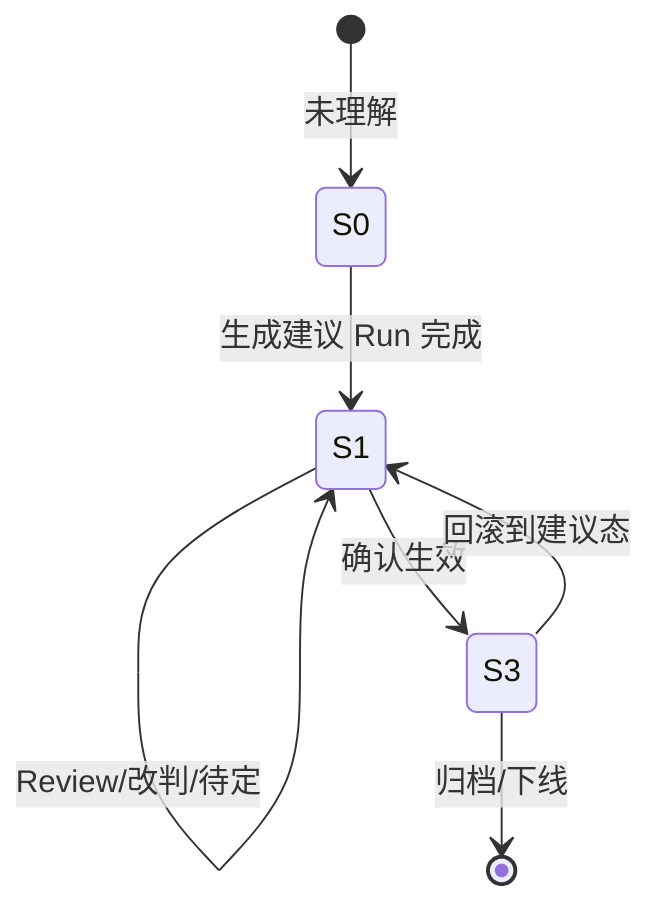
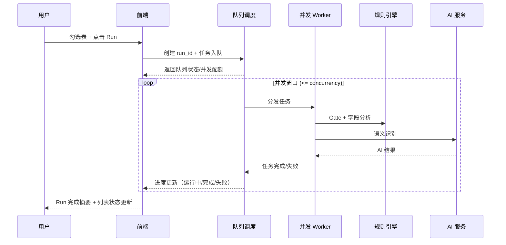

# 逻辑视图与语义理解流程与规则说明（20260117-08）

## 1. 目标与适用范围
本文档面向前端/后端/AI 共同协作，描述当前「逻辑视图 + 语义理解」的完整流程、状态机、表与字段计算规则、评分/审校口径，以及关键交互约束。

覆盖范围：
- 逻辑视图列表页（批量 Run、列表指标、状态流转）
- 语义理解详情页（表级/字段级分析、证据、审校摘要、Review 与确认生效）
- 直接生成业务对象与候选对象流程
- 表/字段计算规则（Gate、评分、字段角色与敏感识别）

## 2. 核心对象与数据结构（与代码一致）

### 2.1 逻辑视图资产（Logical View Asset）
- 来源：扫描结果 `scanResults`
- 关键字段（示例）：
  - `table`：逻辑视图技术名（表名）
  - `comment`：业务描述
  - `fields`：字段数组
  - `status`：`scanned | pending | pending_review | analyzed | confirmed | effective`
  - `governanceStatus`：治理状态（S0/S1/S3）
  - `semanticAnalysis`：语义分析结果（TableSemanticProfile）
  - `reviewStats`：Review 统计（pendingReviewFields / gateFailedItems / riskItems）
  - `lastRun`：Run 信息（run_id / status / time 等）
<span style="color:red">备注：当前实现主要写入 `scanned/pending/pending_review/analyzed`，`confirmed/effective` 仅在状态映射中保留，未实际落库。</span>

### 2.2 表级语义画像（TableSemanticProfile）
- `tableName`
- `gateResult`：Gate 判断（PASS/REVIEW/REJECT）+ 详情
- `ruleScore`：规则评分（naming / behavior / comment / total）
- `aiScore`：AI 评分
- `fieldScore`：字段评分
- `finalScore`：融合评分
- `businessName / description / tags`
- `fields`：字段语义数组
- `governanceStatus`：S0/S1/S3
- `reviewStats`：Review 统计
- `confirmedBy / confirmedAt / confirmScope`：确认生效信息

### 2.3 字段语义画像（FieldSemanticProfile）
- `fieldName` / `dataType`
- `role`：语义角色（Identifier/Status/EventHint/BusAttr/Audit/ForeignKey 等）
- `roleConfidence`：角色置信度
- `sensitivity`：敏感等级（L1/L2/L3/L4）
- `quality`：字段质量评级（A/B/C/D）
- `ruleHit`：命中规则（如 C-01/C-03 等）

### 2.4 评分与审校统计
- `ReviewStats`：
  - `pendingReviewFields`：待Review字段数
  - `gateFailedItems`：Gate 未通过项数
  - `riskItems`：风险项数
- `RunSummary`：
  - `run_id` / `status`（queued/running/success/failed）
  - 采样行数、规则版本、模型版本、并发队列、预计耗时

## 3. 状态机与流程

### 3.1 治理状态
- S0 未理解：未生成语义建议
- S1 建议已生成：进入待Review阶段
- S3 已确认生效：确认结果已生效（可回滚）

### 3.2 典型流程（逻辑视图 → 语义理解）
1) 逻辑视图列表：展示扫描结果与治理指标。
2) 勾选表 → 生成建议 Run（Run 弹窗：采样/规则/模型/并发/队列）。
3) Run 完成 → 表/字段语义建议生成 → 进入 S1（待Review）。
4) 进入详情页：
   - 审校摘要（覆盖率/完整度/风险/Gate/Score）
   - 字段列表（结构/语义视图）
   - 批量 Review（接受/改判/待定）
5) 人工确认 → S3 生效（可回滚）。
6) 若高置信度识别 → 可直接生成业务对象（受 Gate/Review 约束）。

### 3.3 流程图（Mermaid）
```mermaid
flowchart TD
    A[逻辑视图列表] --> B{选择表并发起 Run?}
    B -- 否 --> A
    B -- 是 --> C[生成建议 Run]
    C --> D[Gate 规则 + 字段分析]
    D --> E[AI 语义识别]
    E --> F[融合评分 + 审校摘要]
    F --> G{是否存在待Review?}
    G -- 是 --> H[字段 Review/批量动作]
    G -- 否 --> I[进入确认阶段]
    H --> I
    I --> J{确认生效?}
    J -- 否 --> K[加入候选业务对象 (草稿)]
    J -- 是 --> L{前置校验通过?}
    L -- 否 --> K
    L -- 是 --> M[写入语义注册表]
    M --> N[S3 已确认生效 (可回滚)]
```
<span style="color:red">备注：当前实现中“写入语义注册表/候选池”均为前端状态更新（本地 mock），未接入后端持久化与版本回滚。</span>

### 3.4 时序图（Mermaid）

<span style="color:red">备注：当前实现未调用后端服务，Rule/AI/审计均在前端模拟；Cand/Reg 为本地状态。</span>

### 3.5 状态机图（Mermaid）

<span style="color:red">备注：当前实现仅提供“回滚入口/提示”，尚未落地 S3→S1 的语义确认回滚。</span>

### 3.6 批量 Run 并发/队列时序（Mermaid）

<span style="color:red">备注：当前实现为前端串行模拟执行（setTimeout），并发/队列为 UI 展示，不存在真实调度与并行 Worker。</span>

## 4. 逻辑视图列表页逻辑

### 4.1 列表展示
- 逻辑视图名称 / 业务名称 / 数据源 / 行数 / 更新时间 / 治理状态
- 指标列：待Review字段数 / Gate 未通过项数 / 风险项数（可排序/筛选）

### 4.2 列表筛选/排序
- 筛选：待Review / Gate / 风险
- 排序：待Review字段、Gate未通过、风险项、更新时间

### 4.3 批量 Run
- 入口：右上角“生成建议 Run”
- 配置：采样行数 / 规则版本 / 模型版本 / 并发 / 队列
- 输出：run_id + 状态（排队/运行/完成/失败）

## 5. 表级规则（Gate + Score）

### 5.1 Gatekeeper（硬门槛）
代码：`src/logic/semantic/rules.ts`

- 表类型排除：
  - 强排：`tmp/temp/bak/_rel` → REJECT
  - 灰度：`log/trace/history/detail$` → REVIEW
- 主键校验：存在 `id` 或 `_id` 后缀或 PK 标识
- 生命周期字段：存在 `create_time/update_time/created_at/updated_at/valid_from`

Gate 结果：
- REJECT：表类型不合规
- REVIEW：灰度表或缺主键/生命周期
- PASS：均满足

### 5.2 规则评分（Rule Score）
代码：`src/logic/semantic/scoring.ts`

- T-01 命名规范：前缀 + 业务关键词 + token 数量
- T-05 行为字段密度：行为字段占比越高，评分越低
- T-06 注释覆盖率：表注释 + 字段注释覆盖率

总分：`score.total = naming*0.3 + behavior*0.3 + comment*0.4`

### 5.3 融合评分（Final Score）
- Rule Score = (tableScore + fieldScore) / 2
- Final Score = 0.55 * AI + 0.45 * Rule
- 展示统一为 0–100

## 6. 字段级规则

### 6.1 字段角色识别（规则）
代码：`src/logic/semantic/rules.ts`
- C-01 Identifier：`id` 或 `_id` 或 PK
- C-03 Audit：create_by/update_by/is_deleted/version 等
- C-04 Status：status/state/phase/stage/flag
- C-05 EventHint：`_time/_date/_at`
- C-02 ForeignKey：`_id` 且非主键
- C-06 默认业务属性

### 6.2 敏感等级识别
- L4：password/secret/pwd/id_card/bank
- L3：mobile/phone/id_card/bank_card
- L2：name/email/address
- L1：默认

### 6.3 角色置信度
- 规则命中：0.9
- 默认业务属性：0.6

## 7. 审校摘要（三维指标 + Gate/Score）

### 7.1 三维指标
- 覆盖率：已识别字段数 / 总字段
- 关键要素完整度：由 Gate 结果驱动
  - 生命周期 Gate 未通过 → 显示“缺失（需补齐）”
- 风险项：敏感字段 + 未识别字段

### 7.2 Gate/Score 分区
- Gate：硬拦截结果 + 修复任务
- Score：成熟度评分（表维度/字段维度）

## 8. 字段页（结构/语义视图）与 Review

### 8.1 视图模式
- 结构视图：仅展示物理字段
- 语义视图：展示规则判定 / AI 语义 / 敏感级 / 融合结果

### 8.2 字段分组（A/B/C）
- A 可批量：高置信（≥0.85）+ 低敏感（L1/L2）+ 无冲突
- C 高风险：L3/L4 或低置信（<0.7）或规则/AI 冲突
- B 需下钻：除 A/C 以外

### 8.3 批量 Review 工作台
- 批量接受高置信（仅作用于 Group A）
- 批量改判（进入编辑态）
- 加入待办（待Review）
- 所有动作写入审计日志

### 8.4 融合结果状态
- 建议 / 已确认 / 待定
- 只有“已确认”可用于生成业务对象与问数资产

## 9. 高置信度识别弹窗（直接生成 vs 加入候选）

### 9.1 生成前置校验清单
- 主键已确认
- 生命周期 Gate 通过
- 敏感冲突已处理
- 影响范围可接受（待Review=0 且 Gate=PASS）

未通过任一项：
- 直接生成置灰
- 仅允许加入候选

### 9.2 动作差异
- 直接生成：写入语义注册表（生效，可回滚）
- 加入候选：草稿对象（不生效，待Review）
<span style="color:red">备注：当前实现仅更新本地 businessObjects/candidateResults，不会写入持久化 Registry。</span>

## 10. 证据与日志
- 证据页：支持“冲突解释/反证”结构
- 证据动作：接受/改判/待定 → 自动定位字段 + 写入审计日志
- 审计日志包含 action/source/field/reason/time

## 11. 前后端对齐要点（接口/口径）
- Gate 与 Score 必须分区展示；完整度由 Gate 结果驱动
- 评分统一为 0–100
- Review 状态与字段状态在表/字段/对象层级一致
- 直接生成与确认生效的行为必须可回滚且可审计
<span style="color:red">备注：当前字段 Review 状态与审计日志仅保存在前端内存，刷新后会丢失。</span>

## 12. 代码参考
- Gate 规则：`src/logic/semantic/rules.ts`
- 评分规则：`src/logic/semantic/scoring.ts`
- 三维指标统计：`src/utils/fieldStatistics.ts`
- 逻辑视图列表与详情页：`src/views/DataSemanticUnderstandingView.tsx`
- 审校摘要：`src/views/semantic/DimensionSummary.tsx`
- 评分透视：`src/views/semantic/ScoringBreakdownPanel.tsx`

## 13. 实现现状 vs 目标实现（章节对照）

| 章节 | 实现现状 | 目标实现 | 差距要点 |
| --- | --- | --- | --- |
| 1 目标与范围 | 主要覆盖前端演示与规则说明 | 前后端+模型全链路一致 | 缺后端落库与模型服务 |
| 2 数据结构 | `scanResults` 本地结构可用 | 统一后端 Schema + 版本化 | 缺 run/decision/registry 实体 |
| 3 状态机与流程 | S0/S1/S3 贯通前端 | 全状态（运行/拒绝/排除/回滚） | 缺 S1_RUNNING/S4/S5/S6 |
| 3.3 流程图 | UI 级流程 | 端到端全链路 | 缺采样/画像/落库步骤 |
| 3.4 时序图 | 前端模拟 Rule/AI | 多服务协作 | 缺服务调用与持久化 |
| 3.5 状态机 | 有回滚入口提示 | 可回滚版本 | 缺版本回滚落地 |
| 3.6 并发/队列 | UI 展示 | 真实队列调度 | 缺并发执行与状态回传 |
| 4 列表页 | 指标/排序/筛选 | Run 状态+指标一致 | 缺后端 run_id 查询 |
| 5 表级规则 | 规则与 Gate 可用 | 可配置化/模板化 | 缺模板落库/动态配置 |
| 6 字段规则 | 基础角色/敏感识别 | 统计画像 + 规则扩展 | 缺 profiling 统计入库 |
| 7 审校摘要 | Gate/Score 分区 | 可解释指标一致性 | 缺后端指标口径统一 |
| 8 字段 Review | 批量 Review 前端实现 | 审计/裁决持久化 | 缺决策日志落库 |
| 9 高置信弹窗 | 前置校验 UI+阻断 | Registry 生效 | 缺真实生效写入 |
| 10 证据与日志 | 证据/审计前端记录 | 可追溯证据链 | 缺 evidence/decision 表 |
| 11 对齐要点 | 文档约束已标注 | 全链路验收 | 缺接口/数据一致验证 |
