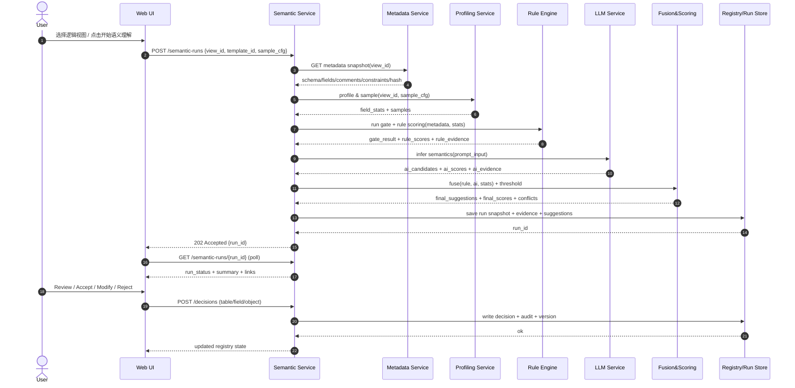

According to a document from 2026-01-17, below is a **“逻辑视图语义理解（Bottom-up）端到端开发规范文档”**（面向研发可落地、面向大模型可执行），覆盖：**流程图、时序图、表/字段规则体系、打分与门槛细节、数据模型、API、页面与交互验收口径**。本规范遵循 BizSemantic v2.3 的不可违背原则：**AI/规则只做建议，用户确认是唯一生效点；Bottom-up 为主；规则管边界、AI 管语义、人管决策；全程可解释、可审计、可回滚**。

---

# 0. 文档元信息

* 文档名称：逻辑视图语义理解引擎 · 工程化规范（v2.4 draft，兼容 v2.3）
* 适用范围：逻辑视图（表/视图）→ 语义建议（表级/字段级/对象级）→ 人工裁决 → 语义资产入库（L1/L3）
* 核心约束：

  * **Suggestion → Decision → Semantic Registry**
  * 每次 Run 必须可复现（metadata hash / 规则版本 / 模型与 prompt 版本 / 评分模板）

---

# 1. 概念与对象（统一口径）

## 1.1 语义分层（平台内核）

* L0：现实业务事实
* L1：业务对象（平台核心资产，唯一）
* L2：使用场景
* L3：对象 ↔ 系统/表/字段映射（允许多映射）

## 1.2 语义对象模型（内部术语，不在 UI 暴露）

* Entity / Event / Snapshot（UI 必须用业务语言表达，**不能暴露内部术语**）

## 1.3 运行与产物

* LogicalView：逻辑视图（表/视图统一抽象）
* SemanticRun：一次语义理解运行（可复现、可对比）
* Suggestion：系统产生的“建议”（表级语义/字段角色/对象候选/升级建议）
* Decision：用户裁决（接受/改判/拒绝/稍后）
* Registry：语义资产库（L1 对象、L3 映射、字段语义、敏感与合规状态）

---

# 2. 端到端流程（Bottom-up 主路径）

BizSemantic v2.3 冻结的主流程如下（必须遵循）：
数据源连接 → 元数据扫描 → 规则 Gate → 规则评分 + AI 语义理解 → 生成候选建议 → 冲突解释 → 用户确认 → 语义资产入库（L1/L3）。

---

# 3. 流程图（Flowchart）

```mermaid
flowchart TD
  A[用户进入 逻辑视图列表] --> B{选择单表/批量?}
  B -->|单表| C[进入逻辑视图详情-S0 未理解]
  B -->|批量| C2[批量创建 SemanticRun]

  C --> D[点击 开始语义理解 -> 创建 Run]
  C2 --> D

  D --> E[元数据快照: schema/字段/注释/约束/血缘(可选)]
  E --> F[数据采样与画像: null率/唯一性/枚举度/长度分布/正则命中]
  F --> G{表级 Gate: 必错表排除?}
  G -->|Reject| G1[Run 状态=Rejected\n输出原因+证据]
  G -->|Pass| H[规则评分: 表/字段结构规则]
  H --> I[调用 LLM: 表语义/字段角色/业务命名/解释/歧义]
  I --> J[融合: RuleScore + AIScore -> FinalScore\n阈值: Auto/Review/Reject]
  J --> K[冲突解释与证据归档]
  K --> L[产出 Suggestions:\n表级语义、字段角色、敏感建议、对象候选、升级建议]
  L --> M[落库: SemanticRun + Evidence + Suggestions]
  M --> N[UI 展示: 概览/证据/字段/评分拆解]
  N --> O{用户裁决 Decision}
  O -->|接受/改判| P[写入 Semantic Registry (L1/L3)\n版本+审计+可回滚]
  O -->|拒绝/稍后| Q[保留 Suggestion\n生成待办]
  P --> R[可选: 生成业务对象候选/生效对象\n受 Gate/Review 约束]
```

---

# 4. 时序图（Sequence Diagram）



---

# 5. 状态机（必须统一贯穿“表/字段/对象”）

> v2.3 明确：**语义不是自动生效的，用户确认是唯一生效点**。

## 5.1 表级状态（LogicalViewSemanticState）

* `S0_UNDERSTANDING_NONE`：未理解
* `S1_RUNNING`：运行中
* `S2_SUGGESTED_REVIEW`：已生成建议（待 Review）
* `S3_CONFIRMED_ACTIVE`：已确认生效（写入 Registry）
* `S4_REJECTED`：被拒绝（保留建议与原因）
* `S5_EXCLUDED`：排除（治理范围外，需原因，可恢复）
* `S6_ROLLED_BACK`：回滚到历史版本

## 5.2 字段级状态（FieldSemanticState）

* `F0_UNSUGGESTED`
* `F1_SUGGESTED`
* `F2_CONFLICT_REVIEW_REQUIRED`
* `F3_CONFIRMED`
* `F4_OVERRIDDEN`（用户改判）
* `F5_REJECTED`

---

# 6. 表维度理解规则（Gate + Rule Score）

v2.3 冻结：规则负责排除必错表、技术字段识别、主键/生命周期/枚举结构；AI 负责语义理解、命名解释与歧义判断；融合采用 RuleScore + AIScore，阈值决定 Auto/Review/Reject；硬规则冲突覆盖，否则进入人工确认。

## 6.1 表级 Gate（硬拦截，命中即 Reject 或强制 Review）

> 目标：**先排除必错表**，避免 AI 在噪声资产上浪费成本。

### Gate-R（Reject 类）

* Log/临时/中间表（命名、分区、字段模式、低注释、写入模式）
* 纯关系映射表（多为两列 ID + 低业务属性）
* 技术元数据表（字段高度技术化）

### Gate-V（Review 强制类）

* 主键不明确（无候选标识符/唯一性不足）
* 生命周期字段缺失（无法判定更新策略/审计字段缺失）
* 表注释缺失或不可读（影响 AI 可靠性与可解释性）

> Gate 与 Score 必须分离：Gate 影响“是否允许生效/是否允许直接生成对象”；Score 用于成熟度与排序。

## 6.2 表级规则评分（Rule Score）

建议将 Rule Score 拆为 3 组（可配置）：

1. **结构完整性**：主键/候选键、生命周期字段、字段类型合理性
2. **可理解性**：表注释完整、字段注释覆盖率、命名规范
3. **表类型契合度**：与评分模板（OLTP/ODS/DWD/维表/快照/日志）一致度

---

# 7. 字段维度理解规则（Field Rules + 统计画像）

## 7.1 字段角色（Primary Role）与互斥口径（摘要必须一致）

冻结口径：摘要统计必须互斥，优先级为：**标识符 > 生命周期 > 状态 > 业务属性**。
详情页允许：Primary Role + Secondary Tags，但摘要、字段列表、敏感统计口径必须一致。

### 推荐 Primary Role 枚举

* `IDENTIFIER`：主键/业务唯一标识（如 employee_id、citizen_id）
* `LIFECYCLE_TIME`：create_time/update_time/etl_time 等
* `STATUS`：状态/枚举（含规则字典）
* `ATTRIBUTE`：业务属性（姓名、地址、级别等）
* `TECHNICAL`：技术字段（etl_batch_id、op_ts、_id 等）

## 7.2 字段统计画像（Profiling）

必须产出并落库（用于规则与 AI 输入）：

* 空值率、唯一性、重复率、枚举度（distinct/rows）、长度分布、正则命中（身份证/手机号/邮箱等）、时间格式命中

## 7.3 敏感识别（Strict）

冻结原则：字段级识别 → 表级聚合（max / exists），表级安全等级=字段最高等级；结论必须可解释且 UI/API 一致。

---

# 8. AI 推理（LLM）输入输出规范（可直接喂给模型）

> AI 只能提出建议，不得自动生效。

## 8.1 Prompt Input（JSON）

```json
{
  "run": {
    "run_id": "uuid",
    "template_id": "DWD_DETAIL_V1",
    "rule_version": "rule-set@2026-01-xx",
    "model_id": "gpt-xxx",
    "prompt_version": "bizsemantic-v2.3@p1",
    "metadata_hash": "sha256:..."
  },
  "logical_view": {
    "view_id": "lv_123",
    "technical_name": "t_hr_employee",
    "business_name": null,
    "comment": "企业核心人力资源主数据",
    "datasource": {"type": "MySQL", "db": "HR_Master_DB"}
  },
  "fields": [
    {
      "name": "employee_id",
      "type": "varchar(20)",
      "comment": "工号",
      "samples": ["1001","1002","1003"],
      "stats": {"null_rate": 0.0, "unique_rate": 0.99, "distinct_rate": 0.99, "pattern_hits": ["ID_LIKE"]}
    }
  ],
  "rule_outputs": {
    "table_gate": {"status": "PASS", "reasons": []},
    "rule_scores": {"pk": 0.6, "comment": 1.0, "lifecycle": 0.0},
    "rule_evidence": [
      {"id": "R_TBL_NAME_PREFIX", "weight": 0.2, "message": "表名前缀符合规范"}
    ]
  }
}
```

## 8.2 Prompt Output（JSON）

```json
{
  "table_semantics": {
    "suggested_business_name": "员工档案",
    "domain": "组织人事域",
    "layer": "DWD",
    "object_type_ui": "主体",
    "granularity": "一行代表一个员工",
    "confidence": 0.89,
    "explanations": [
      {"type": "ai", "weight": 0.30, "evidence": "字段 employee_id 高唯一性且命名符合标识符模式"},
      {"type": "rule", "weight": 0.20, "evidence": "命名结构清晰"}
    ],
    "gate_issues": [
      {"issue": "MISSING_LIFECYCLE_FIELDS", "severity": "BLOCK", "suggest": "补充 created_time/updated_time 或声明来源系统审计字段"}
    ]
  },
  "field_semantics": [
    {
      "field": "employee_id",
      "primary_role": "IDENTIFIER",
      "secondary_tags": ["BUSINESS_KEY"],
      "confidence": 0.95,
      "sensitivity_suggestion": {"level": "L2", "confidence": 0.7, "evidence": ["可能为员工编号，需结合制度确认"]},
      "evidence": {
        "rule": [{"id":"R_ID_PATTERN","weight":0.2,"msg":"命名命中 *_id"}],
        "ai": [{"weight":0.3,"msg":"业务描述为工号"}],
        "stats": [{"weight":0.2,"msg":"唯一性 99%"}]
      },
      "conflict": null
    }
  ],
  "upgrade_suggestions": [
    {
      "type": "BUSINESS_OBJECT_CANDIDATE",
      "object_name": "员工档案",
      "confidence": 0.85,
      "prerequisites": ["CONFIRM_PRIMARY_KEY", "LIFECYCLE_FIELDS_REQUIRED"]
    }
  ]
}
```

---

# 9. 融合与阈值（Final Score → Auto/Review/Reject）

冻结要求：Rule Score + AI Score → Final Score；阈值决定 Auto/Review/Reject；冲突硬规则覆盖，否则人工确认。

## 9.1 融合公式（建议默认，可配置）

* `final_score = w_rule*rule_score + w_ai*ai_score + w_stat*stat_score`
* 默认权重建议：`w_rule=0.35, w_ai=0.50, w_stat=0.15`
  （原因：v2.3 明确 AI 更擅长语义，规则管边界；统计画像辅助定性）

## 9.2 冲突判定

* 若触发硬规则（Gate-V 或 Gate-R）：`final_decision = REVIEW_REQUIRED 或 REJECT`
* 否则：

  * `final_score >= T_auto` → `AUTO_SUGGEST`（仍是 Suggestion，不是生效）
  * `T_review <= final_score < T_auto` → `REVIEW_REQUIRED`
  * `< T_review` → `REJECT`

阈值建议：`T_auto=0.85, T_review=0.60`（可按模板配置）。

---

# 10. 评分模板（Table Health Check）与打分细节

冻结要求：不同表类型使用不同评分模板，模板可自动推荐/手动切换，切换必须展示推荐原因与得分 Diff。

## 10.1 模板数据结构（可落库）

```json
{
  "template_id": "DWD_DETAIL_V1",
  "name": "DWD 明细表标准",
  "dimensions": [
    {"key":"PK_COMPLETENESS","weight":40,"gate":true},
    {"key":"BUSINESS_COMMENT","weight":30,"gate":false},
    {"key":"LIFECYCLE_FIELDS","weight":30,"gate":true}
  ],
  "rules": [
    {"rule_id":"R_PK_EXISTS_OR_HIGH_UNIQUE","dimension":"PK_COMPLETENESS","max_points":40},
    {"rule_id":"R_COMMENT_COVERAGE","dimension":"BUSINESS_COMMENT","max_points":30},
    {"rule_id":"R_LIFECYCLE_FIELDS_EXIST","dimension":"LIFECYCLE_FIELDS","max_points":30}
  ]
}
```

> 说明：上述 **40/30/30** 的维度权重与“生命周期字段缺失导致 0/30、主键不明确导致 0/40、业务注释覆盖得到 30/30”一致，属于你当前 UI 体现的默认模板（建议以配置落地，便于后续扩展到 ODS/维表/快照等）。
> Gate 维度（如 PK、生命周期）用于“是否允许生效/是否允许直接生成对象”的前置条件。

## 10.2 维度计算口径（建议固定）

* PK_COMPLETENESS（0–40）

  * `candidate_pk_count>=1` 且 `unique_rate>=0.98` → 满分
  * 否则按候选强度分段（0/10/20/30/40）
* BUSINESS_COMMENT（0–30）

  * 表注释存在：10
  * 字段注释覆盖率：

    * ≥90%：20
    * 70–90%：10
    * <70%：0
* LIFECYCLE_FIELDS（0–30）

  * 存在 create_time/update_time 或模板允许的同义字段集（created_at/updated_at/op_time/etl_time）：30
  * 仅存在其中一个：15
  * 不存在：0（Gate 未通过）

## 10.3 Score vs Gate（必须分离）

* Gate：是否阻断“生效/对象直接生成”
* Score：成熟度（排序、体检、持续改进）
* UI 必须同时展示并避免混用标尺（0–1 与 0–100 不得同屏混用）

---

# 11. 需求说明（页面/交互/数据/接口）

## 11.1 页面：逻辑视图列表

### 功能

* 展示：数据源树、逻辑视图列表（技术名、业务名、行数、更新时间）
* 批量：支持多选创建 Run（异步）
* 筛选：状态、Gate 未通过数、待 Review 数、风险级别

### 验收

* 批量 Run 创建后返回 `run_id` 列表，列表行显示最新 run 状态（运行中/完成/失败）
* 可按“待 Review 数”排序

## 11.2 页面：逻辑视图详情（S0 未理解）

* Tab：字段结构/关系图谱/语义维度/质量概览
* CTA：开始语义理解（创建 run）

### 验收

* S0 不展示空的“规则判定/AI语义/融合结果”列（默认折叠），避免噪音
* 主键/敏感/必填卡片必须标注来源：元数据事实 / 规则建议 / AI 建议

## 11.3 页面：语义理解结果概览（S2 待 Review）

* 摘要区：通过率、覆盖度、冲突数、待处理、门槛状态、风险等级
* 行动建议：以 Gate 未通过项为主（可点击定位）
* 右侧：结果目录（结论摘要/关键证据/评分拆解）

### 验收

* 点击“待处理 n” → 自动跳转字段列表并过滤到问题字段
* 文案必须由真实指标生成，禁止出现“冲突字段”但冲突=0 的不一致

## 11.4 页面：证据页（Explainability）

* 分栏：AI 证据 / 规则证据
* 每条证据必须包含：`evidence_id / type / weight / target(field|table) / message / drilldown_anchor`

### 验收

* 点击证据可定位字段并高亮
* 冲突时必须有“支持证据 vs 反证”对照区（用于 Review）

## 11.5 页面：字段 Review 工作台（必须具备批量）

> v2.3 要求升级为建议、支持接受/拒绝/稍后与回滚，并展示影响面。

### 功能

* 筛选：未分析、待确认、冲突、Gate 相关
* 批量动作：接受建议 / 改判 / 标记稍后 / 生成待办
* 单字段侧栏：展示规则证据、AI证据、统计画像、融合结论与置信度、敏感建议
* 审计：每次动作记录 decision log（人/时间/理由/前后差异）

### 验收

* 批量接受仅允许在无 Gate 未通过、无冲突字段情况下直接“确认字段语义”；否则必须进入“待确认”

## 11.6 页面：业务对象生成（弹窗/流程）

* 入口：表级语义结论页的“生成对象”
* 分支：

  * 加入候选业务对象（草稿，不生效）
  * 直接生成业务对象（**必须满足 Gate & 必要字段已确认**）

### 验收（P0）

* 若 Gate 未通过（如生命周期字段缺失），**“直接生成”置灰**，仅允许“加入候选”
* 明确提示：直接生成=写入 Registry（生效）；候选=草稿待 Review

---

# 12. 数据模型（建议最小可落地表）

## 12.1 semantic_run

* run_id (pk)
* view_id
* status (RUNNING/SUCCEEDED/FAILED/REJECTED)
* template_id
* metadata_hash
* rule_version
* model_id
* prompt_version
* sample_cfg (json)
* summary (json：coverage、gate_status、risk、pending_count、conflict_count、scores)
* created_at/finished_at

## 12.2 semantic_suggestion_table

* run_id, view_id
* suggested_business_name, domain, layer, object_type_ui, granularity
* final_score, final_confidence
* gate_issues (json)
* explain (json)

## 12.3 semantic_suggestion_field

* run_id, view_id, field_name
* primary_role, secondary_tags
* rule_score, ai_score, stat_score, final_confidence
* sensitivity_suggestion
* evidence_refs (json)
* state (SUGGESTED/CONFLICT/…)

## 12.4 semantic_decision_log（审计必备）

* decision_id
* target_type (TABLE/FIELD/OBJECT)
* target_key
* action (ACCEPT/OVERRIDE/REJECT/LATER/ROLLBACK)
* before/after (json diff)
* operator, reason
* created_at

## 12.5 semantic_registry（L1/L3）

* l1_object (canonical)
* l3_mappings (object ↔ view/field)
* versions, active_version, rollback pointers

---

# 13. API 设计（最小闭环）

## 13.1 创建 Run

`POST /semantic-runs`

```json
{"view_id":"lv_123","template_id":"DWD_DETAIL_V1","sample_cfg":{"rows":2000}}
```

返回：`202 { "run_id":"run_xxx" }`

## 13.2 查询 Run

`GET /semantic-runs/{run_id}`
返回：status + summary + links（evidence/fields/scores）

## 13.3 获取建议（表/字段）

* `GET /views/{view_id}/semantic-suggestions?run_id=...`

## 13.4 提交裁决

`POST /decisions`

```json
{
  "run_id":"run_xxx",
  "decisions":[
    {"target_type":"FIELD","target_key":"lv_123.employee_id","action":"ACCEPT","reason":"工号=主标识"},
    {"target_type":"TABLE","target_key":"lv_123","action":"CONFIRM_ACTIVE","reason":"已补充生命周期字段映射"}
  ]
}
```

## 13.5 生成业务对象候选

`POST /business-objects/candidates`

```json
{"run_id":"run_xxx","view_id":"lv_123","mode":"CANDIDATE_ONLY"}
```

> mode=ACTIVE 需要 Gate 全通过 + 必要字段已确认

---

# 14. 非功能要求（必须做）

* **可复现 Run Snapshot**（metadata hash、规则版本、模型/prompt 版本、评分模板）
* **可审计、可回滚、可版本化**
* 摘要/字段列表/敏感统计口径强一致
* 模板切换必须展示 Diff

---

# 15. 验收清单（关键 P0）

1. 任何 AI/规则产物均为 Suggestion，**不自动生效**；生效必须由 Decision 触发
2. Gate 未通过时：禁止“直接生成业务对象/确认生效”，只能候选或待办
3. 每次 Run 可复现且可对比（版本字段齐全）
4. 冲突必须可解释：硬规则覆盖，否则强制 Review
5. 模板可切换并展示得分 Diff

---

## 你可以直接交付研发的“实现顺序建议”（不需要你再补信息）

1. 先把 **SemanticRun + Evidence + Suggestions 的落库与查询**做出来（跑通端到端）
2. 再做 **字段 Review 工作台（单字段裁决 + 批量裁决）**
3. 最后做 **Registry 生效、版本、回滚** 与 **对象候选/对象生效**（严格受 Gate/Review 约束）

如果你希望我把这份文档进一步“工程化到可直接开任务”（按页面拆成前后端需求、接口字段、验收用例），我可以在下一步直接输出一份：**Jira/飞书任务级拆分 + API Swagger 草案 + 数据库建表 SQL 草案**。
