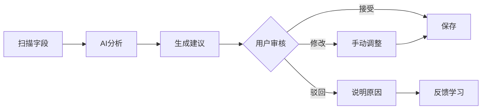

# 语义理解页面分析与改进建议

## 问题概览

基于截图分析，发现以下5个需要改进的问题：


---

## 问题 1: 左侧字段列表单选框的目的不明确 ❓

### 当前问题
- 左侧字段列表显示单选框（radio button）
- 用户不清楚选中某个字段的作用
- 与"字段列表"的命名不匹配单选框的行为

### 问题分析

从界面来看，**单选框不应该是单选，应该是用于选择当前要处理的字段**。

**设计意图**：
- 用户选择某个字段后，右侧区域显示该字段的详细语义信息
- 这是一个"聚焦机制"，让用户逐个处理字段

**问题根源**：
1. **命名不清晰**: "字段列表"没有说明是"可选择的字段列表"
2. **缺少视觉引导**: 没有明确告诉用户"点击字段查看详情"
3. **状态反馈不足**: 当前选中的字段没有明显的高亮或标记

### 改进建议

#### 方案 1: 优化视觉设计（推荐）
```
替换单选框为：
- 整行点击高亮
- 选中状态用左侧色条标识
- 添加"点击查看详情"的提示文字
```

#### 方案 2: 添加说明文字
```
标题改为：【字段列表 - 点击选择要处理的字段】
或在列表上方添加小提示：「选择字段以查看AI建议和进行语义判定」
```

#### 方案 3: 改用高亮行设计
```tsx
// 不使用单选框，直接用行高亮
<div 
    onClick={() => selectField(field)}
    className={`cursor-pointer p-2 ${selected ? 'bg-blue-50 border-l-4 border-blue-600' : 'hover:bg-slate-50'}`}
>
    <span className="font-medium">{field.name}</span>
    <span className="text-slate-500 ml-2">{field.type}</span>
</div>
```

---

## 问题 2: "建议的业务角色"显示"待分析" 🤔

### 当前问题
- 中间区域显示"建议的业务角色"但内容是**"待分析"**
- 有"AI 推理依据"按钮可以查看，说明AI已经分析过
- **矛盾点**: 既然有推理依据，为什么角色是"待分析"？

### 问题分析

这是一个**状态不一致**的问题：

1. **AI已经完成分析**: 有"查看推理依据"说明AI已经推断出结果
2. **UI没有展示结果**: 显示"待分析"说明要么：
   - AI分析失败但没有正确反馈
   - 有分析结果但UI没有正确渲染
   - 数据传递出现问题

### 代码问题定位

可能的原因：
```typescript
// 1. AI分析结果没有正确赋值
field.suggestedRole = undefined  // 或 null 或 ''

// 2. 条件渲染逻辑有问题
{field.suggestedRole ? field.suggestedRole : '待分析'}

// 3. 数据格式不匹配
// 后端返回: { role: 'Identifier' }
// 前端期望: { suggestedRole: 'Identifier' }
```

### 改进建议

#### 短期修复
1. **检查数据流**: 确认AI分析结果是否正确传递到UI
2. **添加降级逻辑**: 
```typescript
const displayRole = field.aiSuggestion?.role || field.suggestedRole || '未识别';
// 不应该显示"待分析"，应该显示"未识别"或"无建议"
```

#### 长期优化
1. **AI分析失败时的友好提示**:
```
❌ 待分析  →  ✅ "未能识别（数据样本不足）"
```

2. **增加置信度展示**:
```
建议角色: Identifier (置信度: 85%)
```

3. **推理依据前置**:
```
不要等用户点击"查看推理依据"，直接在主界面显示关键依据：
"推断为标识符，因为：唯一性100%，命名匹配_id后缀"
```

---

## 问题 3: "数据质量与分布证据"的命名问题 📊

### 当前问题
- 名称："数据质量与分布证据"
- 内容也显示"待分析"
- **问题**: "证据"这个词太学术化，用户不易理解

### 问题分析

**"证据"的问题**：
1. 太法律化、学术化
2. 用户不清楚这是什么证据
3. 与"质量"和"分布"的关系不明确

**更好的命名**：
- ✅ "数据质量分析"
- ✅ "质量检测结果"
- ✅ "数据分布特征"
- ✅ "数据健康度"
- ✅ "质量信号"（最推荐）

### 改进建议

#### 方案 1: 分开显示（推荐）
```
不要混在一起，分成两个独立的卡片：

┌─────────────────────┐
│ 📊 数据质量信号      │
│ - 空值率: 0.00%      │
│ - 唯一性: 100%       │
│ - 主键可能: 是       │
└─────────────────────┘

┌─────────────────────┐
│ 📈 数据分布特征      │
│ - 基数: 10000        │
│ - Top3集中度: 0.1%   │
│ - 数据类型: int      │
└─────────────────────┘
```

#### 方案 2: 改用"质量信号"
```
原名称: 数据质量与分布证据
新名称: 质量信号
说明: "AI 基于以下质量信号进行推断"
```

#### 方案 3: 添加图标和说明
```
🔍 数据健康度检测
├─ 空值率: 0.00% (优秀)
├─ 唯一性: 100% (可作为主键)
└─ 基数: 10000 (中等)
```

---

## 问题 4: "语义角色" vs "业务角色" 概念混淆 🔄

### 当前问题
- 中间区域：**建议的业务角色**
- 右侧判定区：**语义角色**
- 用户困惑：这两个是同一个意思吗？

### 问题分析

从截图和代码看，**这是同一个概念的两个不同称呼**：

**语义角色** (Semantic Role):
- 技术术语
- 包括: Identifier, BusAttr, Status, EventHint, etc.

**业务角色** (Business Role):
- 用户友好的说法
- 本质上是语义角色的业务化表达

**问题**：
1. 命名不统一造成混淆
2. "语义角色"下拉框的选项太技术化：
   - `Identifier` → 用户不知道是什么
   - `BusAttr` → 缩写，不直观
   - `EventHint` → 专业术语

### 改进建议

#### 方案 1: 统一术语（推荐）
```
全部改为"字段角色"或"业务角色"

左侧: AI 建议的字段角色
右侧: 确认字段角色
```

#### 方案 2: 选项人性化（必须）

```typescript
// 当前（技术化）
const roles = ['Identifier', 'BusAttr', 'Status', 'EventHint', 'TechAttr'];

// 改进（用户友好）
const roles = [
    { value: 'Identifier', label: '🔑 标识字段', desc: '唯一标识记录，如ID、编号' },
    { value: 'BusAttr', label: '💼 业务属性', desc: '核心业务信息' },
    { value: 'Status', label: '📊 状态字段', desc: '记录状态、阶段' },
    { value: 'EventHint', label: '⏱️ 事件线索', desc: '时间、操作人等' },
    { value: 'TechAttr', label: '⚙️ 技术属性', desc: '创建时间、更新时间等' },
];
```

#### 方案 3: 添加图标和示例

```tsx
<Select>
    <Option value="Identifier">
        <div className="flex items-center gap-2">
            <span className="text-lg">🔑</span>
            <div>
                <div className="font-medium">标识字段</div>
                <div className="text-xs text-slate-500">如: user_id, order_no</div>
            </div>
        </div>
    </Option>
    <Option value="BusAttr">
        <div className="flex items-center gap-2">
            <span className="text-lg">💼</span>
            <div>
                <div className="font-medium">业务属性</div>
                <div className="text-xs text-slate-500">如: amount, product_name</div>
            </div>
        </div>
    </Option>
</Select>
```

---

## 问题 5: AI建议内容缺失，不符合AI治理理念 🤖

### 当前问题
- 右侧"语义判定"区域的多个字段都是空的
- 缺少AI建议：
  - 语又名称: 空
  - 业务域: 空
  - 备注: 空
- **问题**: 这不符合"AI辅助治理"的设计理念

### 问题分析

**AI辅助治理的核心理念**：
1. AI先分析 → 给出建议
2. 人工审核 → 确认/修改
3. 逐步学习 → 提升准确度

**当前问题**：
```
AI应该为每个字段提供：
✅ 建议的语义角色  → 有（但显示"待分析"有问题）
✅ 建议的又名      → 缺失
✅ 建议的业务域    → 缺失
✅ 建议的备注说明  → 缺失
```

**为什么缺失**？
1. AI模型没有生成这些字段
2. 数据没有从后端传递到前端
3. UI没有正确渲染AI建议

### 改进建议

#### 短期修复: 补充AI建议字段

```typescript
interface AIFieldSuggestion {
    role: SemanticRole;              // ✅ 已有
    confidence: number;              // ✅ 已有
    
    // 需要补充的
    suggestedAlias?: string;         // AI建议的又名
    suggestedDomain?: string;        // AI建议的业务域
    suggestedDescription?: string;   // AI建议的备注
    
    // 推理依据
    reasoning: {
        namingPattern: string;       // 如: "匹配_id后缀"
        dataQuality: string;         // 如: "唯一性100%"
        distribution: string;        // 如: "基数=表行数"
    };
}
```

#### 中期优化: 区分AI建议与用户确认

```tsx
// 右侧判定区应该显示：
<FormField label="语又名称">
    <div className="flex flex-col gap-2">
        {/* AI 建议 */}
        <div className="p-2 bg-blue-50 border border-blue-200 rounded text-sm">
            <span className="text-blue-600 font-medium">🤖 AI建议:</span>
            <span className="ml-2">{aiSuggestion.alias || '部门编号'}</span>
        </div>
        
        {/* 用户输入 */}
        <input 
            placeholder="确认或修改AI建议" 
            defaultValue={aiSuggestion.alias}
        />
    </div>
</FormField>
```

#### 长期优化: 完整的AI辅助流程



**具体实现**:
1. **AI分析全字段**
   ```
   - 字段角色: Identifier (置信度: 95%)
   - 建议又名: "部门ID"
   - 建议域: "组织架构"
   - 建议描述: "部门唯一标识符"
   ```

2. **一键接受 AI 建议**
   ```tsx
   <button onClick={acceptAllAISuggestions}>
       ✨ 接受所有AI建议
   </button>
   ```

3. **批量操作**
   ```tsx
   <button onClick={acceptAllHighConfidence}>
       ⚡ 批量接受 (置信度>80%)
   </button>
   ```

---

## 改进优先级

### P0 - 必须立即修复
1. ✅ **问题2**: 修复"待分析"显示问题
   - 确保AI分析结果正确传递和显示
   - 添加降级逻辑和错误提示

2. ✅ **问题5**: 补充AI建议内容
   - 为所有字段生成完整的AI建议
   - 区分显示AI建议和用户确认值

### P1 - 近期优化
3. ✅ **问题4**: 统一术语和人性化选项
   - 统一"语义角色"和"业务角色"的命名
   - 选项加图标和说明

4. ✅ **问题3**: 优化"证据"命名
   - 改为"质量信号"或分开显示
   - 添加图标和更直观的展示

### P2 - 可规划到后续
5. ✅ **问题1**: 优化字段列表交互
   - 移除单选框，改用行高亮
   - 添加使用提示

---

## 总结

### 核心问题
当前界面存在的主要问题是：
1. **AI能力未充分展示**: AI已分析但结果没显示
2. **专业术语过多**: "证据"、"语义角色"等用户不易理解
3. **交互不直观**: 单选框、"待分析"等容易造成困惑

### 改进方向
应该朝着以下方向优化：
1. **AI先行**: 充分展示AI建议，让用户感受到AI的价值
2. **用户友好**: 用通俗易懂的语言替换专业术语
3. **快捷操作**: 提供批量接受、一键采纳等快捷功能

### 设计原则
- **AI建议可见**: 让用户看到AI做了什么
- **决策透明**: 解释为什么AI这样建议
- **人工可控**: 用户可以轻松修改或驳回
