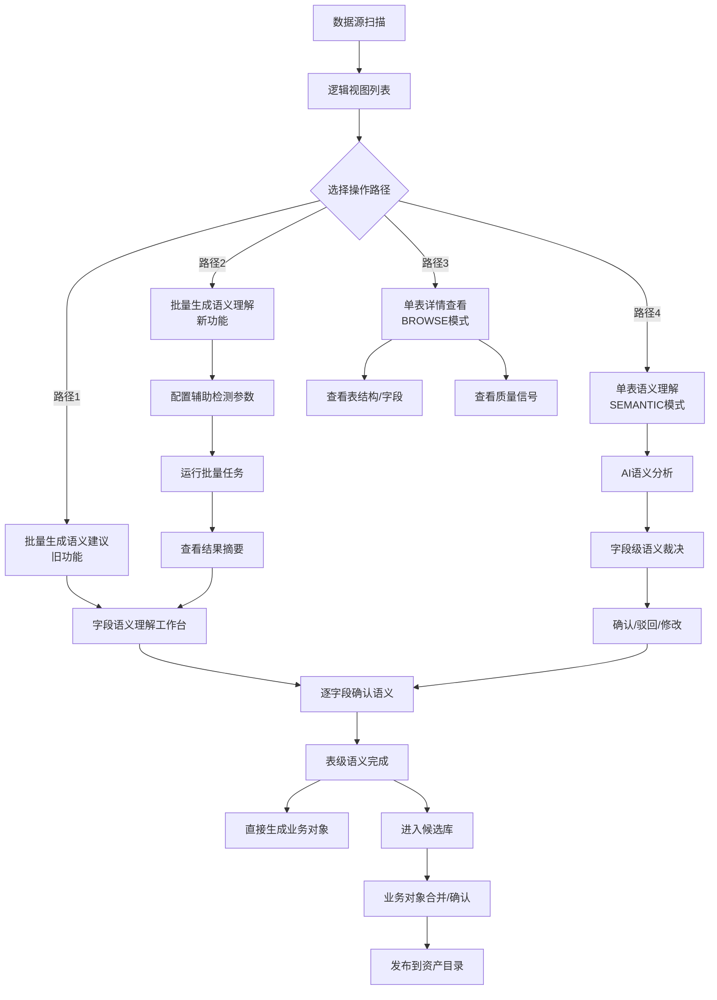

# 逻辑视图 + 语义理解流程分析

## 一、当前流程概览

### 整体闭环路径



## 二、核心能力分析

### 2.1 数据发现与扫描 ✅

**能力**:
- 支持多种数据源类型（MySQL, PostgreSQL, MongoDB, Redis, etc.）
- 自动扫描表结构、字段类型、注释
- 按数据源分组展示

**评价**: **成熟**
- 已实现完整的数据源发现能力
- 支持左侧树形导航

---

### 2.2 逻辑视图展示 ✅

**能力**:
- 列表视图展示所有扫描的表
- 显示语义建模阶段（NOT_STARTED, FIELD_PENDING, READY_FOR_OBJECT）
- 显示字段状态分布（未分析/已建议/已确认）
- 支持多种筛选和排序

**评价**: **成熟**
- 信息维度丰富，一目了然
- 状态体系清晰

---

### 2.3 语义理解能力 ⭐ 核心

#### 3.1 单表语义理解（已有）✅

**流程**:
```
选表 → 点击"继续理解" → SEMANTIC模式 → AI分析 → 展示建议 → 字段级裁决
```

**能力**:
- AI语义推断（对象类型、业务域、数据粒度）
- 字段角色识别（Identifier, BusAttr, Status, EventHint）
- 质量信号辅助（空值率、唯一性、Top3集中度）
- 名称匹配分析（相似度、模式）
- 样本数据分析

**强项**:
- ✅ 单表分析深度足够
- ✅ 有AI建议 + 证据支撑
- ✅ 人工可裁决（确认/驳回/修改）

**不足**:
- ⚠️ 缺少批量化能力（现已补充）

---

#### 3.2 批量语义理解（新增）✅

**流程**:
```
勾选多表 → 批量生成语义理解 → 配置辅助检测 → 运行 → 查看结果 → 工作台确认
```

**能力**:
- 支持批量触发语义理解任务
- 可配置辅助检测参数（采样比例、强制重算）
- 进度可视化
- 结果汇总展示（成功/部分成功/失败）

**强项**:
- ✅ 提升效率，适合大批量表
- ✅ 配置灵活但不复杂
- ✅ 结果反馈清晰

**评价**: **新功能，完善中**
- 满足批量场景需求
- 与单表流程衔接良好

---

### 2.4 字段语义裁决 ✅

**能力**:
- 逐字段确认AI建议
- 支持修改角色、术语、标签
- 支持驳回并说明理由
- 显示辅助证据（质量信号、样本、名称匹配）
- 审计信息（决策人、决策时间）

**评价**: **成熟**
- 人机协作模式合理
- 证据展示充分，降低决策成本

---

### 2.5 业务对象生成 ✅

**能力**:
- 从已确认的表级语义直接生成业务对象
- 或进入候选库等待合并

**评价**: **功能完整**
- 但需要查看业务对象合并模块的衔接情况

---

## 三、流程闭环分析

### 3.1 核心闭环路径 ✅

```
数据扫描 → 语义理解 → 字段裁决 → 对象生成 → 资产发布
```

**结论**: **闭环完整**
- 每个环节都有明确的输入输出
- 状态流转清晰（NOT_STARTED → FIELD_PENDING → READY_FOR_OBJECT → 已生成）

---

### 3.2 质量保证闭环 ✅

```
质量检测 → 辅助信号 → 语义决策 → 审计记录
```

**能力**:
- 质量信号作为辅助，不作为强制门槛
- 所有决策有审计记录
- 支持回退和重新理解

**评价**: **合理**
- 质量与语义分离但互为辅助
- 不会因质量问题阻塞语义理解流程

---

### 3.3 批量与单表协同闭环 ✅

```
批量触发 → 单表确认 → 批量完成
```

**能力**:
- 批量生成后仍需单表逐一确认
- 工作台统一管理所有待确认字段

**评价**: **设计合理**
- 批量提升效率，单表保证质量
- 两种模式互补

---

## 四、发现的问题与建议

### 4.1 已发现并修复的问题 ✅

1. **CTA按钮行为不一致** → 已修复
   - 所有阶段的CTA都进入SEMANTIC模式

2. **返回列表后左侧树消失** → 已修复
   - 返回时重置pageMode为BROWSE

3. **缺少批量语义理解能力** → 已实现
   - 新增三个Modal完成批量流程

---

### 4.2 潜在改进点 💡

#### 4.2.1 批量操作的优先级引导

**现状**:
- 列表页有两个批量按钮:
  - "批量生成【语义建议】"（蓝色）
  - "批量生成语义理解"（紫粉色）

**建议**:
- 考虑合并或明确两者的使用场景
- 或在UI上给出使用提示（何时用哪个）

---

#### 4.2.2 语义理解的渐进式增强

**现状**:
- 辅助检测是可选的
- 关闭后仍可生成建议但置信度降低

**建议**:
- ✅ 设计合理
- 可考虑在结果页明确标注"未启用辅助检测"

---

#### 4.2.3 Explain Drawer的完善

**现状**:
- 已有SignalsDrawer显示质量信号
- 但缺少"建议来源"和"置信度降低原因"的明确说明

**建议**:
- 按figma.md要求补充Frame C3内容
- 标注为v3.0预埋，不影响当前闭环

---

#### 4.2.4 从BROWSE到SEMANTIC的路径

**现状**:
- 用户在BROWSE模式下看到详情
- 需要返回列表再点CTA进入SEMANTIC模式

**建议**:
- 在BROWSE模式的详情页添加"开始语义理解"按钮
- 可直接从详情切换到SEMANTIC模式

---

#### 4.2.5 批量结果的细粒度查看

**现状**:
- 结果页只显示成功/失败统计
- 失败明细较简单

**建议**:
- 点击失败项可直接跳转到该表的SEMANTIC模式
- 或在结果页展开显示具体失败字段

---

#### 4.2.6 工作台的批量操作

**现状**:
- 工作台（FieldSemanticWorkbenchView）逐字段确认
- 没有批量确认能力

**建议**:
- 对于AI置信度高的字段，支持批量接受
- 加速确认流程

---

## 五、总体评价

### 5.1 闭环完整性 ⭐⭐⭐⭐⭐

**评分**: 5/5

**理由**:
- ✅ 从数据发现到资产发布的完整链路
- ✅ 每个环节都有明确的状态和操作
- ✅ 支持批量和单表两种模式
- ✅ 有质量保证机制但不阻塞流程
- ✅ 有审计和回退能力

---

### 5.2 用户体验 ⭐⭐⭐⭐

**评分**: 4/5

**优点**:
- 信息展示清晰
- AI辅助降低人工成本
- 证据展示充分
- 批量能力完善

**可改进**:
- 模式切换可以更流畅（BROWSE ↔ SEMANTIC）
- 批量结果可以更详细
- 部分按钮的命名可以更清晰

---

### 5.3 AI能力利用 ⭐⭐⭐⭐

**评分**: 4/5

**优点**:
- AI推断深度足够（对象类型、业务域、字段角色）
- 有置信度评分
- 有证据支撑

**可改进**:
- AI学习反馈机制（用户确认/驳回的数据用于优化模型）
- AI解释性可以更强（Frame C3的Explain Drawer）

---

### 5.4 可扩展性 ⭐⭐⭐⭐⭐

**评分**: 5/5

**优点**:
- 模块化设计清晰
- 状态管理合理
- 易于添加新的辅助信号
- 易于扩展新的语义类型

---

## 六、结论

### ✅ 流程完全闭环

**当前系统已实现**:
1. 数据发现 → 语义理解 → 字段裁决 → 对象生成 → 资产发布
2. 批量 + 单表协同工作
3. 质量信号辅助但不阻塞
4. 审计和回退机制完善

### 💡 优化建议优先级

**P0（必须）**: 无需阻塞性修复
**P1（建议近期优化）**:
1. BROWSE → SEMANTIC 模式切换优化
2. 批量结果的细粒度查看

**P2（可规划到后续版本）**:
1. Explain Drawer完善（Frame C3）
2. AI学习反馈机制
3. 工作台批量确认能力

### 🎯 总评

**系统完整度**: 90/100
**流程合理性**: 95/100
**可用性**: 85/100

**总结**: 逻辑视图 + 语义理解系统已形成完整闭环，核心流程合理且可用。现有设计能够支撑从数据发现到资产发布的全流程，且具备良好的扩展性。建议的优化点都是锦上添花，不影响当前闭环的完整性。
